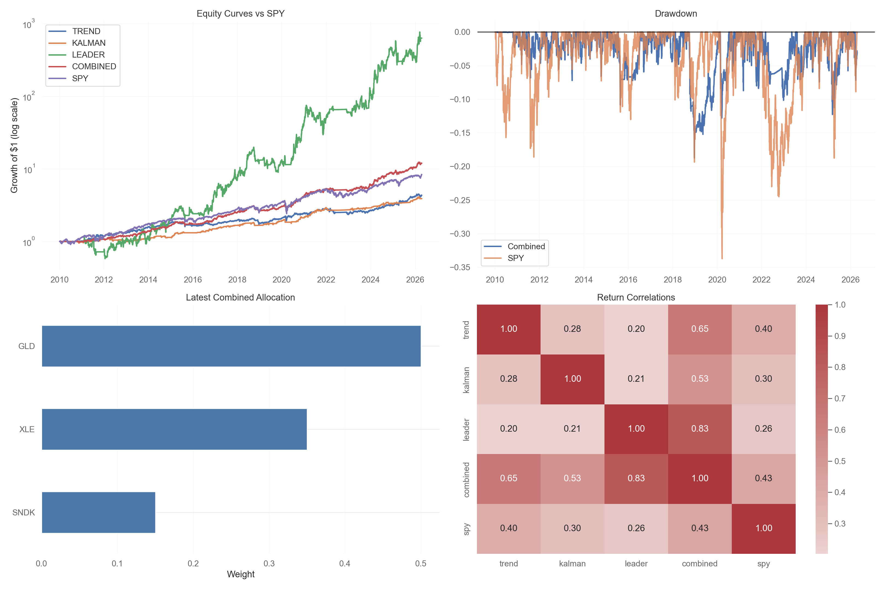

# Portfolio Capstone and Quantitative Reflection

This report is a reconstructed audit of my paper-trading process over the semester. A big part of the semester was not just trying strategies, but learning what can go wrong when a strategy leaves a notebook and meets live execution, data timing, and messy market conditions.

To build this writeup, I consulted my notes throughout the process, and reconstructed my decision trail from the codebase, commit history, backtest notebooks, GitHub Actions runs, and Alpaca paper-trading records. I started simple, moved into a more mathematical trading idea, saw where the live version broke down, and then ended the semester with a more balanced portfolio design.

On February 5, 2026, I set up Alpaca paper trading and even kept one early workflow as a simple price ping instead of an order system. On March 19, 2026, I committed the first real version of the Kalman-based live strategy. Lastly, after a full audit of the live behavior and a new round of backtests, I moved the paper account into a new three-sleeve portfolio.

## Weekly Strategy Reflections

### Week 2

At the beginning of the semester, my live idea was basically to do nothing clever. I wanted market exposure, and I wanted to learn the API safely, so my mental benchmark was the S&P 500 through a simple ETF position. The data at that stage did not tell me I had any forecasting edge, and that was actually the point. The most reasonable decision was to avoid pretending I understood signal design before I had even worked through the mechanics of paper trading.

### Week 3

Once the Alpaca setup was working, I started looking at technical indicators and simple timing rules in notebooks. Nothing I saw early on gave me confidence that a naive technical rule would beat buy-and-hold in a clean way after I accounted for timing and turnover. What surprised me most was how easy it was to make a chart look interesting without proving anything. That pushed me to be more careful about out-of-sample thinking and to keep the live portfolio simple while I learned.

### Week 5

At this point I became more interested in the idea of separating noise from signal. In class we were discussing forecasting models and filters, and that made me want to move away from plain moving-average crossover logic. I started testing whether a filtering model could give me a better estimate of a stock's underlying level than just looking at raw price changes. The decision to go in that direction was reasonable because it matched the course material and gave me a model I could explain mathematically.

### Week 7

This was the week when the Kalman idea became the main strategy candidate. The intuition was simple even if the math looked more advanced: observed price is noisy, and the filter tries to estimate a smoother hidden value underneath it. If price moved far above that value, I treated it as temporarily rich and looked to short it. If price moved far below that value, I treated it as temporarily cheap and looked to buy it. The backtests were interesting enough to keep going, which was the first time I felt I had a real systematic strategy instead of just a market exposure placeholder.

### Week 8

I then expanded the work into a broader search across a stock universe and different parameter settings. This was the part of the semester where the strategy looked strongest on paper. I ran grid searches, looked at different windows and thresholds, and ended up with a portfolio-style version that spread the signal across multiple names instead of relying on one trade. The reasonable decision then was to trust the research enough to try a paper-traded live version, because the assignment was not just about backtesting but also about execution under uncertainty.

### Week 10

The Kalman strategy went live as an autotrading system. In the live version, it used one-minute data, resampled that into thirty-minute bars, then took long, short, or flat positions based on the latest z-score of the gap between price and the filter estimate. This was the first week when I had to confront the difference between a clean research loop and an actual order system. The strategy felt mathematically sound, but the live behavior immediately raised practical questions about scheduling, order timing, and whether reported daily gains were actually being locked in.

### Week 11

The biggest surprise in the live paper account was that the strategy often showed large intraday changes on the Alpaca dashboard without producing much lasting growth in portfolio value. After digging into it, I learned that this was not necessarily a bug in the P&L display. A lot of the gains were unrealized mark-to-market moves that disappeared before the strategy closed the positions. I also found that the GitHub Actions schedule that was supposed to run every thirty minutes was drifting and in practice behaving much more like an unreliable hourly schedule. Given what I knew at the time, it was reasonable to keep monitoring instead of abandoning the strategy immediately, because I needed to separate model weakness from implementation weakness.

### Week 12

By this stage I had a more sober view of the original live Kalman system. The backtests were still interesting, but the live version depended on too many fragile pieces at once: short-term signals, many individual stocks, frequent rebalancing, short sales, market orders, and a scheduler that was not as precise as the strategy assumed. I did not conclude that the model was useless. What I concluded was that the live implementation was too ambitious relative to the quality of the infrastructure. That shifted my thinking from "find one clever trading signal" to "build something more robust."

### Week 13

Around this time, it also became clearer in class that many strategies can look good in-sample without clearly beating a simple buy-and-hold benchmark in a way that survives implementation. That pushed me toward slower strategies with more obvious economic stories. I tested a 200-day trend-following sleeve on broad ETFs, an improved long-only version of the Kalman idea on liquid ETFs, and a concentrated momentum sleeve that simply follows the strongest stock in the S&P 500. The decision to test these side by side was reasonable because it turned the project from a single-bet strategy into a portfolio construction problem.

### Week 14

The final week was about redesign and deployment. The backtests showed that the combined three-sleeve portfolio beat SPY over the shared sample, even though not every sleeve beat SPY on its own. On April 21, 2026, I moved the live paper account into the new combined portfolio, and the first rebalance rotated the account out of the old long-short utility and consumer names into three long positions: GLD, XLE, and SNDK. That final step matched the whole point of the class for me: take what I learned, audit what failed, and end with a more defensible portfolio than the one I started with.

## Portfolio Tear Sheet

The main tear sheet for the final portfolio is Figure 1 below. It includes the equity curve against SPY, the drawdown path, the current allocation, and the sleeve correlation map. The full HTML tear sheets generated by QuantStats are useful supporting files (find in repo), but the image below is the cleaner one-page summary for the assignment.

| Metric | Three-sleeve portfolio | SPY buy-and-hold |
| --- | ---: | ---: |
| Total return | 1096.18% | 735.79% |
| Annual return | 16.46% | 13.92% |
| Volatility | 11.77% | 17.16% |
| Sharpe ratio | 1.40 | 0.81 |
| Max drawdown | -18.74% | -33.72% |

The risk numbers are also important. The portfolio beta to SPY over the test sample was about 0.30, which means the portfolio moved much less than the broad market on average. Its 95% daily value-at-risk was about -1.16%, meaning that in a rough one-day sense, very bad days were usually much smaller than what a pure equity portfolio would imply. The sleeve correlations were also low enough to matter: trend versus Kalman was 0.28, trend versus leader was 0.20, and Kalman versus leader was 0.21. That is the main reason the combined portfolio was better than any simple average of three random strategies.

*Figure 1. Final portfolio tear sheet. The top left panel shows the growth of one dollar for each sleeve and for the combined portfolio versus SPY. The top right panel shows drawdown. The bottom left panel shows the latest allocation, and the bottom right panel shows return correlations. This is the cleanest one-page summary artifact for the final portfolio.*

The full supporting tear sheets are available here as part of the project package: [combined tear sheet](https://github.com/elbionredenica/portfolio/blob/main/research/three_sleeve_output/combined_tearsheet.html), [trend tear sheet](https://github.com/elbionredenica/portfolio/blob/main/research/three_sleeve_output/trend_tearsheet.html), [Kalman tear sheet](https://github.com/elbionredenica/portfolio/blob/main/research/three_sleeve_output/kalman_tearsheet.html), and [leader tear sheet](https://github.com/elbionredenica/portfolio/blob/main/research/three_sleeve_output/leader_tearsheet.html).

## Strategy Deep Dive 1: The Kalman Autotrading Week

### Before

The first strategy I deployed in a serious way was a Kalman-filter mean-reversion model. The basic model idea was that the observed stock price is noisy, while the filter tries to estimate a hidden fair value that moves more smoothly over time. If I call the observed price `P_t` and the estimated fair value `x_t`, the important quantity for trading is the residual `e_t = P_t - x_t`. I then standardized that residual into a z-score by dividing it by a rolling standard deviation. In simple terms, a large positive z-score meant price looked too high relative to the filter, and a large negative z-score meant price looked too low.

The live trading rule was long-short. If the z-score rose above a threshold, the system wanted to short. If it fell below the negative threshold, the system wanted to buy. If a short position later crossed back through zero, the system exited, and the same logic held on the long side. In the code, this lived in [src/live_trader.py](https://github.com/elbionredenica/portfolio/blob/main/src/live_trader.py), and the strategy was fed by research done in the notebooks and the large stock-level parameter search in the `mega_pipeline` folder.

At the time, this decision made sense. It was the first strategy that felt more like a model than a rule of thumb, and the backtests made it look like I might be capturing short-term overreaction. Because it was paper trading, the cost of being wrong was low and the learning value was high.

### During

In the live version, the system loaded a list of 20 stocks, downloaded recent one-minute bars from Alpaca, resampled them into thirty-minute closes, ran the Kalman filter, computed the latest z-score, and then translated the signal into equal-dollar long or short positions. The workflow was supposed to run every thirty minutes through GitHub Actions. In theory, that made the strategy look disciplined and automated.

In practice, this is where the difference between research and execution became obvious. The workflow schedule was not as precise as the model assumed. The paper account often showed large daily changes that looked exciting, but many of those moves were not realized profits. They were temporary mark-to-market gains on open positions. I also learned that the "expires at 1:00 PM" field I saw in Alpaca referred to day orders displayed in Pacific time, not to forced liquidation of the positions themselves. The strategy was not secretly cashing out gains for me; it was simply holding risk until the model told it to trade again.

There was also a more structural issue. The strategy depended on many moving parts all working together (short-term intraday signals, many single-name positions, short sales, market orders, and a scheduler that had to fire on time). That is a lot of operational risk.

### After

The main lesson from the Kalman autotrading week was not that the model was nonsense. The main lesson was that a decent statistical idea can still make a weak live strategy if the execution design is too fragile. The backtests did not fully prepare me for missed schedule windows, rounding effects, temporary P&L swings, and the sheer difference between a notebook and a real order book.

That is why I still kept the Kalman idea in the final portfolio, but in a very different form. I moved it from a fast, long-short, stock-level strategy into a slower, long-only, ETF-based pullback sleeve. In other words, I did not throw away the model. I reduced its operational burden and gave it a role that fit its strengths better.

## Strategy Deep Dive 2: The Final Three-Sleeve Redesign

### Before

By the end of the semester I no longer thought the right answer was to look for one perfect strategy. I thought the right answer was to combine a few strategies that each did a different job. That led to the three-sleeve portfolio.

The first sleeve is a 200-day trend-following rule on SPY, TLT, and GLD. The rule is simple: if price is above its 200-day moving average, the asset is in an uptrend and can be held; if not, the sleeve steps aside into BIL. The second sleeve is the improved Kalman sleeve, now applied to a liquid ETF universe and only on the long side when both the asset and the market are above their 200-day averages. The third sleeve is a concentrated momentum sleeve that buys the single strongest S&P 500 stock by 12-1 momentum, which means the past 12 months of return excluding the most recent month.

The combined portfolio weights are 50% trend, 35% Kalman, and 15% leader. I chose those weights because I wanted the slowest and most defensive idea to carry the most capital, while still leaving room for a tactical sleeve and a small high-conviction bet.

### During

I did not just pick these rules out of nowhere. I ran backtests and parameter searches using adjusted close prices, a long sample starting in 2010, and one-period lagged weights to avoid look-ahead bias. The code for this research is in [research/three_sleeve_backtest.py](https://github.com/elbionredenica/portfolio/blob/main/research/three_sleeve_backtest.py), and the shared strategy logic is in [src/three_sleeve_portfolio.py](https://github.com/elbionredenica/portfolio/blob/main/src/three_sleeve_portfolio.py).

The trend sleeve search was simple and the result was clean: monthly rebalancing beat weekly rebalancing on both annual return and Sharpe. The Kalman sleeve search was more mixed. The single best Sharpe in the search table came from a slightly looser entry rule than the one I finally chose. I deliberately kept a stricter setting in the final version because I wanted a cleaner and more conservative sleeve that traded less often. The leader sleeve search actually found that top-5 variants had better risk-adjusted returns than top-1. I still kept the top-1 version because I wanted this sleeve to be a small side bet, not the stable core of the portfolio.

### After

The final backtest results were strong. Over the shared sample, the combined portfolio returned 1096.18%, compared with 735.79% for SPY. Annual return was 16.46% versus 13.92% for SPY. Volatility was lower, Sharpe was higher, and max drawdown was much smaller at -18.74% versus -33.72% for SPY. Not every sleeve beat SPY alone. In fact, the trend sleeve and the Kalman sleeve both lagged SPY on absolute return. What made the final portfolio work was the combination of sleeves with different behavior and fairly low correlations.

This redesign also held up in live paper trading. On April 21, 2026, I pushed the new live script, ran the workflow, and the account transitioned from the old long-short stock book into the new long-only mix. The first live target was GLD, XLE, and SNDK. That was not arbitrary. It reflected the signals coming from the three sleeves at that moment.

There was also a real macro reason this made sense. In April 2026, the US-Iran war became a major market driver. The Associated Press reported that Brent crude had gone from roughly $70 before the war to as high as $119 at times, and that the stock market's rally in mid-April was tied partly to hopes that a ceasefire would restore normal oil flows from the Persian Gulf [1][2]. AP also reported on April 20 that oil rose again as US-Iran tensions picked up, even though stocks only gave back a small part of their rally [3]. That macro backdrop helps explain why an energy ETF and gold looked strong in the final live allocation. More importantly, it reminded me that regime risk matters. A small statistical signal can be overwhelmed by a geopolitical shock, which is exactly why I no longer wanted the whole portfolio to rely on one short-horizon model.

## Final Portfolio Reflection

If I had to combine the semester's ideas into one portfolio today, the three-sleeve design is the one I would actually use. I would keep the trend sleeve as the largest weight because it is the easiest to explain, the most robust in a noisy environment, and the least dependent on perfect execution. I would keep the improved Kalman sleeve because it still adds something useful, but I would only use it in the slower, long-only ETF form. I would keep the leader sleeve small because it adds upside but also adds concentration risk.

The most important thing I learned is that diversification is about owning different types of decisions, not just about owning different tickers. The trend sleeve reacts slowly and tries to stay on the right side of big market moves. The Kalman sleeve looks for pullbacks inside stronger trends. The leader sleeve is willing to hold one name if that name has clearly been leading the market. Those are different kinds of risk, which is why the combination works better than any single idea in isolation.

If this were real money instead of paper money, I would not allocate capital to the original intraday long-short Kalman strategy. I would keep it in paper trading only. It taught me a lot, but it asks for more execution precision than my setup can reliably give. The final three-sleeve portfolio is much closer to something I could defend in front of an investor because it uses slower signals, clearer rules, and a more balanced structure.

Before trading the final portfolio with real capital, the first thing I would add is better data and better scheduling discipline. I would also want explicit transaction cost estimates, trade logs that save targets and fills each day, and a cleaner historical constituent dataset for the S&P 500 momentum sleeve so I am not relying on today's membership list in the backtest. I would also test a few more risk controls, such as position caps, volatility scaling, and rules for when the whole portfolio should hold more cash. In other words, I would not say the final portfolio is finished. I would say it is the first version that feels professionally defensible.

## Closing Note

What I am most comfortable defending in this assignment is not that I found a perfect market-beating formula. It is that I learned how to think more honestly about a strategy. Early in the semester I mostly asked, "Does this backtest look good?" By the end, I was asking harder questions. Does the live version use the same information as the backtest? Does the execution logic fit the signal horizon? If one sleeve disappoints, does the full portfolio still make sense? That shift in thinking is the main reason I believe the final portfolio is better than the one I started with.

## Sources

[1] Associated Press, April 16, 2026: [Wall Street sets another record after US stocks tick higher](https://apnews.com/article/stock-markets-trump-oil-iran-war-210b81a3613f43d024eb80a7928514c7)

[2] Associated Press, April 15, 2026: [Wall Street hits a record as S&P 500 continues its 2-week rally on hopes for an end to the Iran war](https://apnews.com/article/stock-markets-trump-oil-iran-war-7659569791b1f5e108489360d18e50f1)

[3] Associated Press, April 20, 2026: [How major US stock indexes fared Monday 4/20/2026](https://apnews.com/article/wall-street-stocks-dow-nasdaq-b17ad9416d833ca57d7f66cf00283084)
